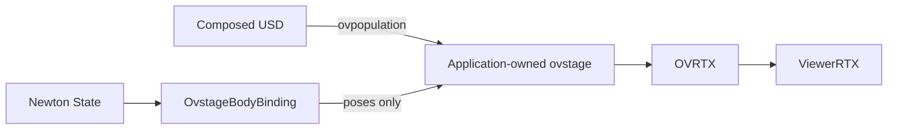

# ViewerRTX with a caller-owned ovstage

This branch prototypes the first step of source-preserving RTX rendering.
It does **not** require ovnewton or change Newton's physics importer.



## Implemented

- `ViewerRTX(stage=..., renderer=..., render_product=...)` consumes an existing
  scene. It does not create a USD export, import visuals, add lights, change
  materials, or publish simulation state.
- `newton.viewer.OvstageBodyBinding` writes affine body poses through ovstage's
  current transform API. It validates destination paths, supports CPU/CUDA
  payloads, and preserves explicit rest offsets, scale and reflection.
- The application owns the global publication floor and synchronous render
  order. Closing the viewer/binding leaves its stage and renderer alive.
- Headless screenshots use full RenderVar paths. An optional small window
  previews a fixed camera through a CPU image copy.

The regular `ViewerRTX()` path remains available. Its inherited ViewerUSD
construction and older OVRTX scene API have **not** been refactored in this
prototype. `OvstageBodyBinding` is the proposed transport seam; ovnewton has
not yet adopted it. Packaging it outside Newton remains possible.

## Use the actual prototype API

Install Newton normally. In an isolated environment, add the tested public
runtime pair (NVIDIA's package index may be required):

```sh
uv pip install 'ovrtx==0.5.0.377615' 'ovstage==0.2.0.377349' pillow
```

The transport imports ovstage only when instantiated. Newton's required
dependencies and existing extras are unchanged. Native rendering can operate
without PXR installed; source preparation and the regular ViewerRTX path use
Newton's existing USD dependency. The NVIDIA packages retain their own
licenses; this prototype does not vendor or redistribute them.

```python
import ovrtx
import ovstage
from newton.viewer import OvstageBodyBinding, ViewerRTX

# Register any additional physics schema bundles before the first schema read.
ovrtx.register_schema_paths()
renderer = ovrtx.Renderer(config=ovrtx.RendererConfig(sync_mode=True))
stage = ovstage.Stage("scene")
renderer.attach_ovstage(stage)
ovstage.population.open_usd(
    stage, "scene.usda", ordinal=1, domains=ovstage.PopulationDomain.ALL
)
stage.advance_write_floor(1).wait()

# model/state already exist; mapping belongs to the final model.
binding = OvstageBodyBinding(
    stage, model, ordinal=1,
    prim_paths=paths,
    body_indices=indices,
    body_local_transforms=offsets,  # N x 4 x 4, float64, USD row-vector layout
)
viewer = ViewerRTX(
    stage=stage, renderer=renderer,
    render_product="/Render/Camera", headless=True,
)

binding.write(state, ordinal=2)
# Other camera/material writes may join this same application update.
stage.advance_write_floor(2).wait()
products = viewer.render(ordinal=2)
viewer.save_screenshot("frame.png")

viewer.close()
binding.close()
renderer.detach_ovstage()
stage.destroy()
renderer.destroy()
```

Use `try/finally` for production lifecycle management. The replay script below
demonstrates cleanup on exceptions. A stage can be attached to one renderer;
the passed renderer must already be attached to the passed stage.

### Mapping contract

For each destination prim, the bridge writes:

```python
prim_world = body_local_transform @ body_world
# Reference-pose construction, also in USD row-vector layout:
body_local_transform = source_prim_world @ inverse(reference_body_world)
```

Offsets must be computed from matching source and Newton reference poses.
Both must use the same units, basis and world placement. Parent transforms
stop at each driven prim (`omni:resetXformStack=True`); descendants retain
their source hierarchy. Several source prims may follow one collapsed body.
Duplicate destination paths, missing transform columns, and invalid body
indices are rejected before mutation.

Supply final-model indices explicitly. Rebuild mappings after cloning,
collapse, body reordering or topology changes. The existing USD importer's
`path_body_map` can seed a mapping; implicit label matching is not used.
There is no automatic cross-builder mapping remap in this prototype.

### Prepare and replay an existing source scene

The scene must already contain camera, lights and a RenderProduct. Keep the
complete composed environment and its asset dependencies. The preparation
command uses the existing Newton importer and FK on meter-scale, Z-up USD;
replay creates only a pose-array carrier and does **not** run a physics solver.

```sh
uv run --extra importers --with usd-core==25.11 scripts/prototypes/rtx_ovstage.py prepare scene.usda poses.npz
uv run --with ovrtx==0.5.0.377615 --with ovstage==0.2.0.377349 --with pillow scripts/prototypes/rtx_ovstage.py replay scene.usda poses.npz --render-product /Render/Camera --output capture.png
```

For an import-free replay process, run the second command in a separate
environment containing Newton, OVRTX and ovstage but no PXR. Add pyglet for
`--window`; the default is headless. Screenshots and timing JSON are written
beside the requested output. The source USD and fixture must describe the
same composed scene, with identical body paths and reference poses.

## Validation

- New ownership tests demonstrate that the native path bypasses ViewerUSD
  construction and never commits or destroys caller-owned resources.
- Real ovstage CPU/CUDA tests check permuted body indices, full affine
  offsets, Boolean reset flags, repeated body indices, missing prims,
  invalid inputs and binding lifetime.
- The two key external-scene tests fail against the original ViewerRTX with
  `unexpected keyword argument 'stage'`.
- The existing USD viewer suite and new tests pass in the original environment;
  optional ovstage tests skip when that package is absent.

Run the portable tests, or install the public runtime pair to include the
real ovstage tests:

```sh
uv run --extra dev -m unittest newton.tests.test_viewer_rtx_stage newton.tests.test_viewer_usd
```

Three fresh-process headless replays on the RTX 4090 / Windows test machine
completed 60 moving frames after at least 30 seconds of warmup. The new APIs
were used for both state publication and rendering; PXR and ovnewton were
absent from each replay process. These are smoke measurements, not a
controlled comparison against another implementation or a physics benchmark.

| Scene | Driven prims | Median frame | Median encoding/write/publication |
|---|---:|---:|---:|
| ANYmal + heightfield | 17 | 11.30 ms | 4.07 ms |
| 64 ANYmals | 1,088 | 41.37 ms | 22.55 ms |
| Franka + checker ground | 11 | 10.61 ms | 3.70 ms |

The 64-robot publication cost reproduces the research result; this prototype
does not fix that runtime bottleneck. The full pre-commit suite passed using
pre-commit 4.3.0, which is compatible with the test host's older Git.
The preparation command reproduced the prior Franka fixture; a separate short
Franka run exercised the optional window preview and cleanup.

## Remaining work

1. Extract the existing viewer's scene generation/presentation responsibilities
   and use the same transport in its owned-stage mode.
2. Make PXR and ovstage readers feed one Newton physics interpretation pipeline.
   This branch does not copy or replace the ovnewton parser.
3. Provide remapping through builder composition, native instancing, deformation,
   and interactive overlays/cameras.
4. Improve publication cost and qualify complete Isaac Lab workloads against
   matched Kit reference captures. Source preservation alone does not establish
   renderer parity.

The bridge is synchronous, is not CUDA-graph capturable, and is not a snapshot
or concurrent-writer API. Finish rendering before the next write. The fixed
camera window is a prototype preview, not the full Newton interactive GUI.

Primary contracts: [OVRTX external stages](https://nvidia-omniverse.github.io/ovrtx/core/ovstage_integration.html),
[ovstage transforms](https://github.com/NVIDIA-Omniverse/ovstage/blob/71f917ad449d104fb062c6149221cda13417814b/docs/scene/transforms.rst),
[ovstage tensor ownership](https://github.com/NVIDIA-Omniverse/ovstage/blob/71f917ad449d104fb062c6149221cda13417814b/docs/concepts/dlpack_tensors.rst).
