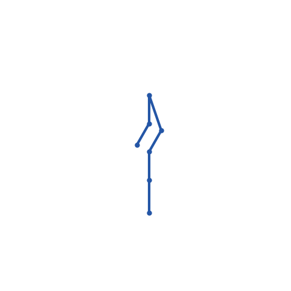

# Mimic Joints Clear-Cut Report

This branch now treats representable mimic relationships as joints, not as a parallel
model-level mimic-constraint store. URDF and USD mimic metadata imports into
zero-DOF `JointType.MIMIC` followers, FK derives follower transforms inline from the
leader coordinate, and the MuJoCo bridge lowers those MIMIC joints internally when
MuJoCo needs an equality row.

## Implementation

- `JointType.MIMIC` stores a zero-DOF follower joint in the normal joint tree.
- Per-joint metadata records `joint_mimic_leader`, `[offset, multiplier]`, follower
  scalar type, and follower axis.
- URDF `<mimic>` tags import as MIMIC joints by default. The old
  `mimic_constraints_as_joints` argument is retained only for call-site
  compatibility; passing `False` no longer restores separate constraint storage.
- USD `NewtonMimicAPI` and `PhysxMimicJointAPI` import as MIMIC joints, including
  pending follower conversion when the referenced leader is parsed later.
- `eval_fk()` and batched IK FK evaluation consume MIMIC joints directly.
- `SolverMuJoCo` exports a synthetic scalar MuJoCo follower joint plus an
  `mjEQ_JOINT` row for each Newton MIMIC joint. That equality row is solver-private
  lowering, not a Newton model mimic-constraint representation.

The legacy `ModelBuilder.add_constraint_mimic()` API remains present for older
callers and existing tests, but importers and the report path no longer recommend it.

## Branch vs Main Benchmarks

Command used from each checkout:

```bash
uv run --with numpy --with warp-lang --with usd-core --with mujoco \
  --with matplotlib --with pillow --with trimesh --with scipy \
  reports/mimic_joints_prototype/benchmark_mimic_assets.py \
  --samples 20 --repeats 3 \
  --json-out reports/mimic_joints_prototype/asset_benchmark_branch.json
```

The main checkout used the same script from this branch and wrote
`asset_benchmark_main.json`. Timings are per-sample FK means on `cuda:0`.

| Asset | Branch coords / DOFs | Main coords / DOFs | Branch mimic joints / constraints | Main mimic joints / constraints | Branch FK mean | Main FK mean |
| --- | ---: | ---: | ---: | ---: | ---: | ---: |
| Synthetic Robotiq URDF | 1 / 1 | 6 / 6 | 5 / 0 | 0 / 5 | 352.2 us | 544.4 us |
| Robotiq 2F85 USD | 6 / 6 | 14 / 12 | 0 / 0 | 0 / 1 | 343.9 us | 698.6 us |
| Robotiq 2F85 MJCF | 6 / 6 | 14 / 12 | 0 / 0 | 0 / 1 | 351.0 us | 483.0 us |
| LEAP hand MJCF | 16 / 16 | 16 / 16 | 0 / 0 | 0 / 0 | 408.5 us | 320.2 us |
| Shadow hand MJCF | 24 / 24 | 24 / 24 | 0 / 0 | 0 / 0 | 401.2 us | 331.0 us |
| Unitree G1 with hands URDF | 43 / 43 | 43 / 43 | 0 / 0 | 0 / 0 | 420.8 us | 400.1 us |

The mimic-heavy Robotiq cases are the relevant comparison. The branch removes the
extra follower coordinates and separate mimic-constraint storage from the synthetic
URDF case, and the real Robotiq USD/MJCF imports no longer carry the main-branch
mimic-constraint row. Assets without mimic relationships are included as control
cases; they show no coordinate-count change and only ordinary run-to-run timing
noise.

## Real-Asset Captures

Generated captures from the branch benchmark:

- [Synthetic Robotiq URDF](videos/synthetic_robotiq_urdf.gif)
- [Robotiq 2F85 USD](videos/robotiq_2f85_v4_usd.gif)
- [LEAP hand MJCF](videos/leap_hand_right_mjcf.gif)
- [Shadow hand MJCF](videos/shadow_hand_right_mjcf.gif)

The minimal kinematic example remains available at:

```bash
uv run --with numpy --with warp-lang --with matplotlib --with pillow \
  newton/examples/robot/example_robot_mimic_joint_kinematics.py \
  --samples 200 --repeats 5 \
  --json-out reports/mimic_joints_prototype/benchmark_results.json \
  --gif-out reports/mimic_joints_prototype/mimic_joint_kinematics.gif
```



## Solver Notes

FK and IK now have the cleanest behavior: the follower is a zero-DOF joint, its
transform is derived inline from the leader, and no separate mimic-coordinate
propagation step exists.

MuJoCo support is implemented by solver-private lowering. Newton still stores the
relationship as a MIMIC joint; MuJoCo receives the synthetic coordinate and
`mjEQ_JOINT` row it needs for stepping.

XPBD, Featherstone, Semi-Implicit, and VBD should implement dependent-coordinate
force handling for MIMIC joints when they grow dynamic mimic support. They should
not preserve or reintroduce a separate importer-facing mimic-constraint path for
URDF/USD mimic metadata.

## Verdict

The clear cut is the right direction: mimics are joints. Importers should attach
mimic metadata to joints, FK/IK should consume that directly, and solvers should
either consume `JointType.MIMIC` natively or lower it internally without exposing a
second model-level mimic representation.
